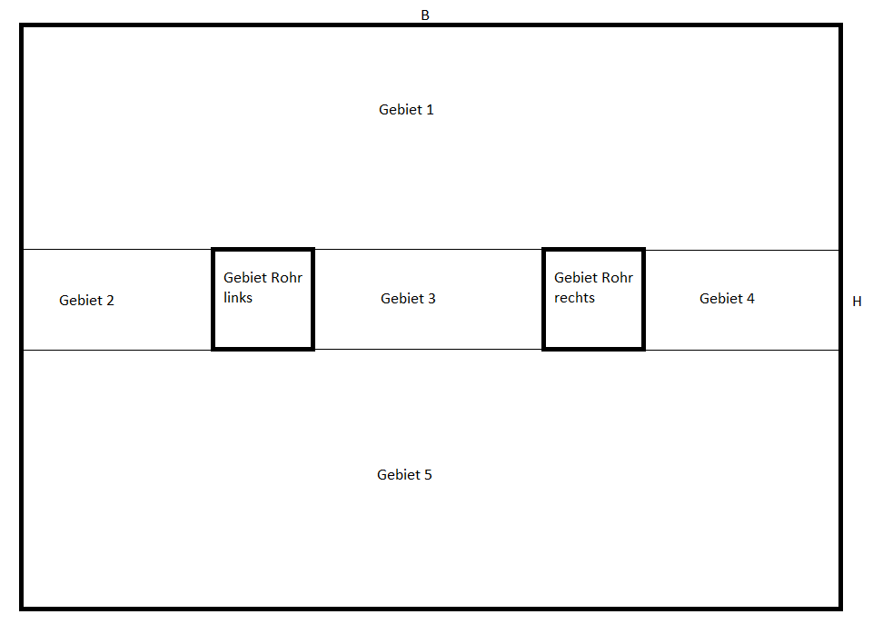

# Numerische Simulation statische Strömungsverteilung im Boden

Numerische Simulation statische Strömungsverteilung im Boden. Modell nach D’ARCY. 

## Geometrie

Aufteilung der simulierten Gebiete:

## Ergebnisse

[Druckverteilung](doc/beleg_druck.pdf)

[Geschwindigkeit](doc/beleg_geschwindigkeitsvektor.pdf)

[Geschwindigkeit x-Richtung](doc/beleg_ux.pdf)

[Geschwindigkeit y-Richtung](doc/beleg_uy.pdf)